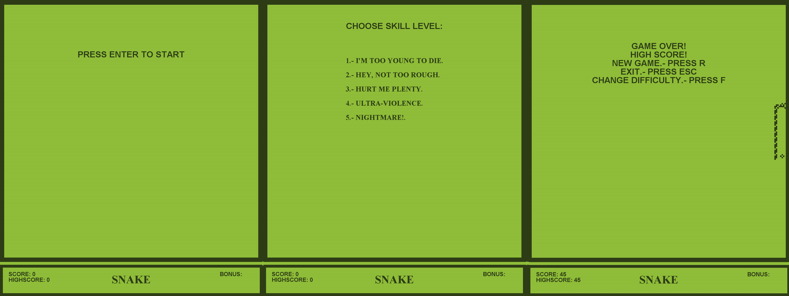
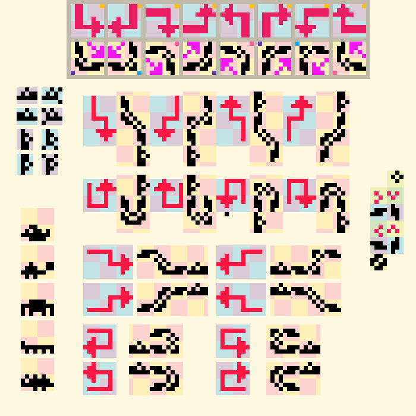

### Snake GUI

---

This repository contains the implementation of the classic Snake game using linked lists in Java. The main feature of this project is the incorporation of a graphical engine that provides an interactive visual experience to the player.

If you're only interested in trying out the game without reading further details, you can do so directly on the link that will take you to my website where it's online and ready to play [Here](http://fismat.umich.mx/~anguiano/snake/vibora.html).

#### What is Snake?

Snake, also known as "the Snake," is a simple video game in which the user controls a snake that must reach randomly generated elements on the screen, called "food." In this implementation, the game follows the traditional mechanic where the snake grows in size by eating food and ends the game if it collides with itself or with the edges of the game area.

#### Technical Implementation Details:

- **Screen and Elements:** The game is represented in a playing area called the "board," implemented as a matrix that stores the state of each cell. Each cell can be empty, occupied by the snake, food, a border, or a bonus element.

  

- **Movement:** The snake's movement is performed through an execution loop that updates the snake's position based on the direction indicated by the user.

- **User Interaction:** In each movement cycle, the user can choose the direction in which they want to move the snake. Additionally, they can pause the game, restart it in case of Game Over, and close the game window.

  

- **Graphics:** The game elements are visually represented based on the information stored in the board matrix. Rectangles are used to represent the different elements of the game, such as the snake, food, and borders. The graphical representation of the snake is managed through an additional matrix that indicates the direction and shape of each part of the snake's body.

  

- **Linked List Implementation:** The snake is represented as a linked list, where each node corresponds to a part of the snake's body. When eating food, a node is added to the end of the list, increasing the length of the snake.

#### Extras and Customization:

- The game includes options to select difficulty, which affects the movement speed and initial length of the snake.
- Bonus elements are randomly generated, providing extra points to the player if reached during a variable time window each time.
- The game features different screens, such as the start screen, selection screen, and Game Over screen, where the user can make specific decisions.

#### How to Run the Game

To run the game, follow these steps:

1. Make sure you have the JDK (Java Development Kit) installed.
2. Clone this repository to your local machine.
3. Open a terminal in the project's root directory.
4. Compile all project files by executing the following command:
   javac \*.java
5. Once compiled, run the game by executing the following command:
   Java Main
6. To stop the game and close the window, press the `ESC` key.

#### Conclusions and Learnings:

This project has been an interesting challenge that has allowed exploring concepts such as linked lists, thread handling, and graphical representation in Java. It has been learned to integrate different components of the language to create a complete and satisfying gaming experience. Additionally, understanding the interaction between different objects and classes to achieve efficient game operation has been strengthened.

#### References:

- University of Washington's Course on Data Structures and Algorithms: [Link](https://courses.cs.washington.edu/courses/cse143/01au/homework/hw6/index.html)

---

Have fun playing Snake! If you have any questions or suggestions, feel free to contact me.