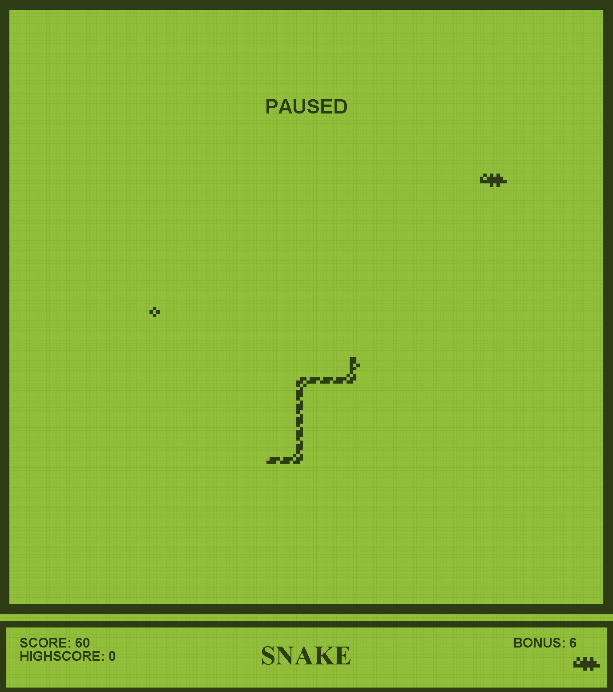
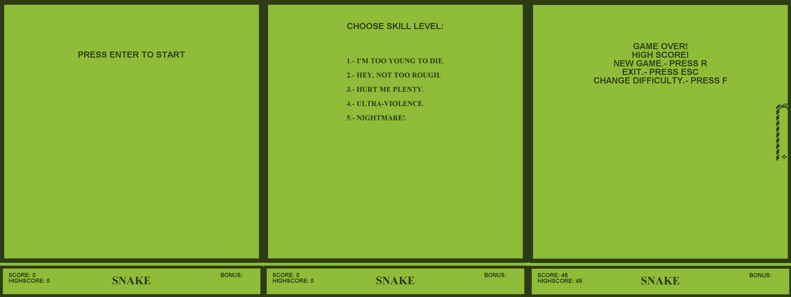
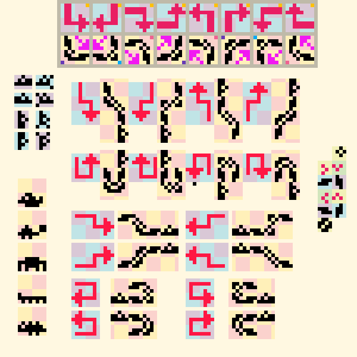

### Snake GUI

---

Este repositorio contiene la implementación del clásico juego Snake utilizando listas enlazadas en Java. La principal característica de este proyecto es la incorporación de un motor gráfico que proporciona una experiencia visual interactiva al jugador.

Si solamente te interesa probar el juego sin leer más detalles, puedes hacerlo directamente en el elace que te llevara a mi sitio donde se encuentra online listo para jugar [Aquí](http://fismat.umich.mx/~anguiano/snake/vibora.html).

#### ¿Qué es la Viborita?

Snake, también conocido como la "viborita", es un videojuego simple en el que el usuario controla a una serpiente que debe alcanzar elementos generados aleatoriamente en pantalla, llamados "alimentos". En esta implementación, el juego sigue la mecánica tradicional donde la serpiente aumenta de tamaño al comer alimentos y termina el juego si colisiona consigo misma o con los bordes del área de juego.

#### Detalles técnicos de la implementación:

- **Pantalla y elementos:** El juego se representa en un área de juego llamada "tablero", implementado como una matriz que almacena el estado de cada celda. Cada celda puede estar vacía, ocupada por la serpiente, un alimento, un borde o un elemento de bonificación.

  

- **Movimiento:** El movimiento de la serpiente se realiza mediante un ciclo de ejecución que actualiza la posición de la serpiente en función de la dirección indicada por el usuario.

- **Interacción del usuario:** En cada ciclo de movimiento, el usuario puede elegir la dirección en la que desea mover la serpiente. Además, puede pausar el juego, reiniciarlo en caso de Game Over y cerrar la ventana de juego.

  

- **Gráficos:** Los elementos del juego se representan visualmente en función de la información almacenada en la matriz del tablero. Se utilizan rectángulos para representar los diferentes elementos del juego, como la serpiente, los alimentos y los bordes. La representación gráfica de la serpiente se gestiona mediante una matriz adicional que indica la dirección y la forma de cada parte del cuerpo de la serpiente.

  

- **Implementación de listas enlazadas:** La serpiente se representa como una lista enlazada, donde cada nodo corresponde a una parte del cuerpo de la serpiente. Al comer un alimento, se agrega un nodo al final de la lista, lo que aumenta la longitud de la serpiente.

#### Extras y personalización:

- El juego incluye opciones para seleccionar la dificultad, lo que afecta la velocidad de movimiento y la longitud inicial de la serpiente.
- Se generan elementos de bonificación de forma aleatoria, los cuales proporcionan puntos extra al jugador si los alcanza durante una ventana de tiempo variable cada vez.
- El juego cuenta con diferentes pantallas, como la pantalla de inicio, la pantalla de selección y la pantalla de Game Over, donde el usuario puede tomar decisiones específicas.

#### Cómo ejecutar el juego

Para ejecutar el juego, sigue estos pasos:

1. Asegúrate de tener instalado el JDK (Java Development Kit).
2. Clona este repositorio en tu máquina local.
3. Abre una terminal en el directorio raíz del proyecto.
4. Compila todos los archivos del proyecto ejecutando el siguiente comando:
   javac \*.java
5. Una vez compilado, ejecuta el juego ejecutando el siguiente comando:
   Java Main
6. Para detener el juego y cerrar la ventana, presiona la tecla `ESC`.

#### Conclusiones y aprendizajes:

Este proyecto ha sido un desafío interesante que ha permitido explorar conceptos como listas enlazadas, manejo de hilos y representación gráfica en Java. Se ha aprendido a integrar diferentes componentes del lenguaje para crear una experiencia de juego completa y satisfactoria. Además, se ha fortalecido la comprensión de la interacción entre diferentes objetos y clases para lograr un funcionamiento eficiente del juego.

#### Bibliografía:

- Curso de la Universidad de Washington sobre Estructuras de Datos y Algoritmos: [Enlace](https://courses.cs.washington.edu/courses/cse143/01au/homework/hw6/index.html)

---

¡Diviértete jugando al Snake! Si tienes alguna pregunta o sugerencia, no dudes en ponerte en contacto conmigo.
